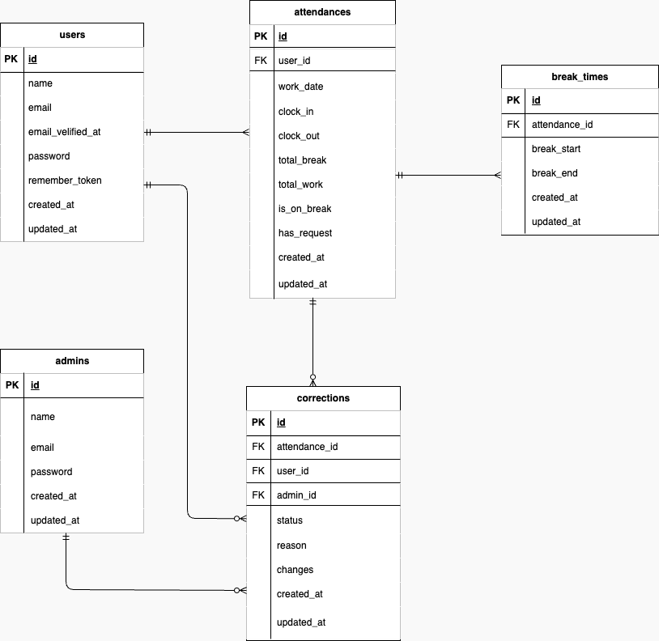

# 勤怠管理アプリ （TimeTrack）

## 環境構築

### Docker ビルド
- 1.git clone git@github.com:okumurachie/TimeTrack.git
- 2.docker-compose up -d --build

### laravel 環境構築
- 1.docker-compose exec php bash
- 2.composer install
- 3.cp .env.example .env(.env.example ファイルから.env を作成し、環境変数を変更)

        DB_HOST=mysql
        DB_DATABASE=laravel_db
        DB_USERNAME=laravel_user
        DB_PASSWORD=laravel_pass

        MAIL_MAILER=smtp
        MAIL_HOST=mailhog
        MAIL_PORT=1025
        MAIL_FROM_ADDRESS=hello@example.com

- 4.php artisan key:generate
- 5.php artisan migrate
- 6.php artisan db:seed

## 使用技術（実行環境）
- PHP 8.4.8
- Laravel 10.48.29
- MySQL 8.0
- nginx 1.21.1

## ER 図

## URL

- 開発環境：http://localhost/
- 会員登録：http://localhost/register
- phpMyAdmin:http://localhost:8080/

---
## ユーザーのログイン情報

- 管理者ログイン画面(/admin/login)
- 一般ユーザー会員登録画面(/register)
- 一般ユーザーログイン画面(/login)

### 管理者ユーザー
- name:管理者1
- email:admin1@coachtech.com
- password:admin1234
---
- name:管理者2
- email:admin2@coachtech.com
- password:admin5678

### 一般ユーザー
- name:西 伶奈
- email:reina.n@coachtech.com
- password:abcd1234
---
- name:山田 太郎
- email:taro.y@coachtech.com
- password:abcd5678
---
- name:増田 一世
- email:issei.m@coachtech.com
- password:dcba1234
---
- name:山本 敬吉
- email:keikichi.y@coachtech.com
- password:dcba5678
---
- name:秋田 朋美
- email:tomomi.a@coachtech.com
- password:abcd4321
---
- name:中西 教夫
- email:norio.n@coachtech.com
- password:abcd8765

# TimeTrack
